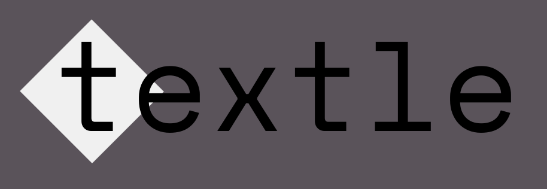

# Welcome to the `textle` documentation!



`textle` is a cross-platform tool designed to simplify the creation, modification and use of document pipelines.

Have you ever chained together `pandoc`, `xetex` or others and thought to yourself, "Wow! This is a massive pain!"? `textle` aims to ease this process,
letting you define how your project is built in seconds with its pipeline syntax, and even letting you store templates to further speed up the process of starting a new project.

## Getting started

An extremely basic use of `textle` would be simply

```
$ textle new "tex:my_tex.tex -> pdf:my_tex.pdf"
```

but it can range all the way to things like

```
$ textle new "pandoc.markdown:essay.md -> tex.xetex + biblatex.biber:bib.bib -> pdf:essay.pdf" --externals /home/matthew/mla-template.tex --pandoc:template mla-template.tex --pandoc:bib_source biblatex
```

Once this is done, getting the document is as easy as

```
$ textle go
$ # or if you want it to build it live
$ textle live
```

For more information, see the [user guide](tut_1.md)

If you want to extend `textle` with new steps, see the [API index](api_index.md).

